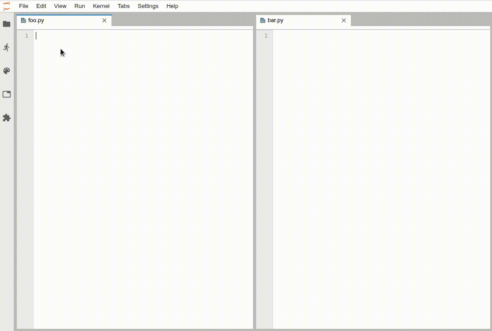

# jupyterlab-python-bytecode

[](https://travis-ci.com/jtpio/jupyterlab-python-bytecode)
[](https://www.npmjs.com/package/jupyterlab-python-bytecode)
[](https://github.com/prettier/prettier)

JupyterLab extension to inspect Python Bytecode.



## Prerequisites

- JupyterLab 0.34
- `ipykernel`

## Installation

```bash
jupyter labextension install jupyterlab-python-bytecode
```

## Contributing

See [CONTRIBUTING.md](./CONTRIBUTING.md) to know how to contribute and setup a development environment.

## How it works

Disassembling the Python code is done by connecting to a kernel, and sending the following code for evaluation from the lab extension:

```python
import dis
dis.dis(code_to_evaluate)
```

[As mentioned in the documentation](https://docs.python.org/3/library/dis.html), there is not guarantee on the stability of the bytecode across Python versions:

> Bytecode is an implementation detail of the CPython interpreter. No guarantees are made that bytecode will not be added, removed, or changed between versions of Python. Use of this module should not be considered to work across Python VMs or Python releases.

### Example

For example, if the Python file contains the following lines:

```python
import math

print(math.pi)
```

The following code will be sent to the kernel for evaluation:

```python
import dis
dis.dis("""
import math

print(math.pi)
""")
```

Which will return (example for CPython 3.6.6):

```python
  1           0 LOAD_CONST               0 (0)
              2 LOAD_CONST               1 (None)
              4 IMPORT_NAME              0 (math)
              6 STORE_NAME               0 (math)

  3           8 LOAD_NAME                1 (print)
             10 LOAD_NAME                0 (math)
             12 LOAD_ATTR                2 (pi)
             14 CALL_FUNCTION            1
             16 POP_TOP
             18 LOAD_CONST               1 (None)
             20 RETURN_VALUE
```
